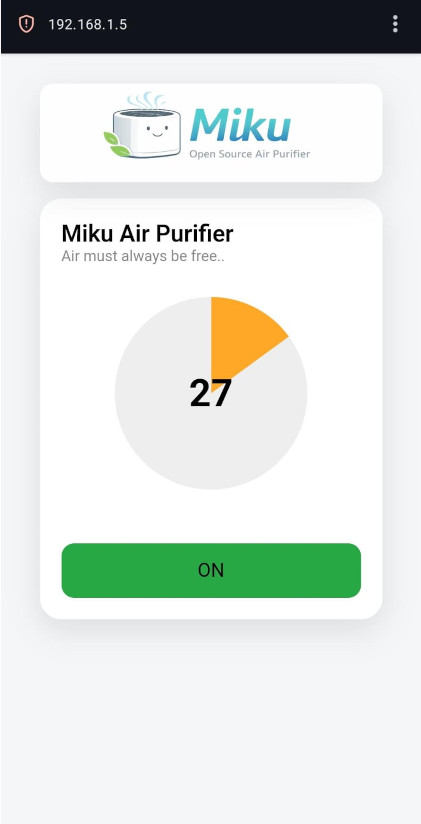

# Miku

## Welcome to Miku ##
* Miku is an open source esp8266 based smart air purifier.
* It can be controlled via its dedicated web app hosted locally on the esp8266 controller.
* It senses the air quality of the room and generates alerts on the app and shows current AQI. 
* Ultra lightweight and simple UI, no navigation required.
* Interface suitable for both laptops and mobile devices.

## Hardware Requirement
* Enclosure made of MDF thick board or any other strong material
* HEPA filter
* Active carbon filter
* Filter mesh
* DC Fan
* 24V power supply to run the dc fan
* 5/3.3V trigger relay board
* 24V to 5V dc-dc converter
* Esp8266 MCU
* PM2.5 GP2Y1010AU0F Dust Smoke Particle Sensor
* Wires, connectors, power switch, fasteners and miscellaneous 

## Usage
* Modify the `miku_esp8266/src/main.cpp` to use your wifi credential and connect to it.
* It prints its IP address on serial monitor during startup. 
* You can make it static on your router.
* Use `platform.io` extension in `vscode` for building and flashing the code into an esp8266 node mcu
* Connect FAN relay to D1 and `PM2.5 GP2Y1010AU0F Dust Smoke Particle Sensor` on A0 of esp8266
* Now you can see live AQI from the sensor on the web app and control the FAN relay ON/OFF 
* Hardware design of Miku to be released soon. But it can be anything you want depending on filter shape.

## Web UI

## Contributor
[Ritesh Sharma](https://www.linkedin.com/in/ritexarma/)
